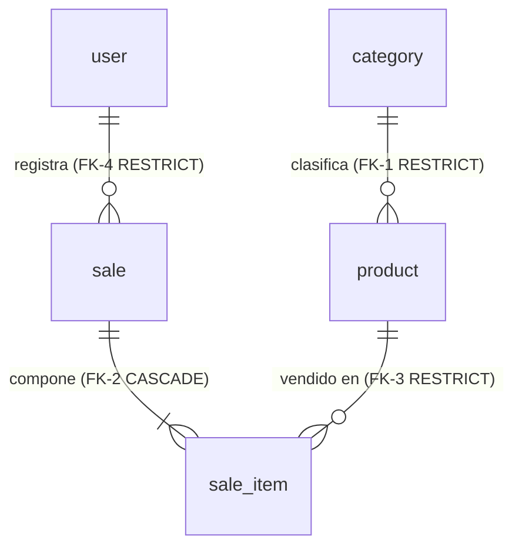

# Modelo de datos — Simple Stock Flow

**El único sitio donde vive el modelo de datos.** Quien implemente no necesita abrir el código ni
conectarse al motor para saber qué debe haber, de qué tipo, con qué regla y **dónde debe vivir esa
regla** (motor, dominio o ambos).

- **Fecha:** 2026-10-02
- **Estado:** modelo de **diseño**. Todavía no existe ningún esquema. Lo que el documento afirma es lo
  que las migraciones deben producir; las consultas de [§10](#10-cómo-se-comprueba-que-este-documento-no-miente)
  son **sondas por ejecutar** contra el motor, sin salida registrada.
- **Motor:** MySQL 8.4 LTS, InnoDB, `utf8mb4` con colación `utf8mb4_0900_ai_ci`, base `stockflow`
  (servicio `db` del compose, usuario `stockflow`).
- **Rige bajo:** [`constitution.md`](constitution.md) (innegociable) y [`spec.md`](spec.md) (qué y
  por qué). Las decisiones técnicas D-01…D-10 están en [`plan.md`](plan.md) §1; la forma del
  sistema, en [`architecture.md`](architecture.md); las cuatro decisiones estructurales, en
  [`adr/`](adr/).
- **`plan.md` no describe el esquema.** Sus §2 y §3 enlazan aquí. Si algo de allí contradice a
  este documento, gana este documento; si este documento contradice al motor una vez migrado,
  **gana el motor** (artículo X) y el documento está roto.

---

## Cómo se lee este documento

Toda regla del modelo lleva una marca de **dónde debe vivir**, y **solo hay tres**:

| Marca | Significa |
|---|---|
| **motor** | La impone MySQL (`NOT NULL`, `UNIQUE`, `CHECK`, clave foránea). Un `INSERT` manual la respeta o falla |
| **dominio** | La garantiza el código Python (`src/stockflow/domain/`, aplicación o adaptador) y el motor no puede expresarla. **Un `INSERT` por un cliente SQL la salta sin ruido** |
| **ambos** | El dominio la aplica para dar un error con significado, y el motor la repite como barrera de última instancia |

**Por qué existe la tercera marca.** Una invariante que solo vive en Python protege a la
aplicación, no a los datos: cualquier cliente SQL, cualquier migración y cualquier servicio futuro la
saltan sin enterarse. [ADR-002](adr/adr-002-concurrencia-optimista.md) fijó el criterio para
`stock >= 0` —*si la restricción salta, algo escribió fuera del adaptador*— y ese criterio vale para
**todas** las invariantes expresables en el motor. Regla de diseño: **toda invariante que MySQL pueda
expresar baja al motor** (se escribe en T-02 y se prueba en T-20), y lo que no puede se declara **dominio** y se prueba en el dominio.

**Dos advertencias propias de MySQL que condicionan todo lo demás:**

1. **Modo estricto obligatorio.** `sql_mode` debe incluir `STRICT_TRANS_TABLES` (valor por defecto en
   8.4). Sin él, MySQL trunca y redondea en silencio un `DECIMAL` o un `VARCHAR` demasiado largo y
   las barreras de este documento dejan de serlo. Se comprueba en [§10](#10-cómo-se-comprueba-que-este-documento-no-miente).
2. **El DDL no es transaccional.** Cada `CREATE`/`ALTER` hace *commit* implícito: una migración que
   falla a la mitad deja el esquema **parcial**. Se declara riesgo en [§3.2](#32-migraciones-previstas).

---

## 0. Convención de nombres del esquema

**Las cinco tablas van en singular.** Lo manda la tabla de convenciones de la gobernanza, y el
proyecto se alinea con ella:

| Elemento | Convención | Ejemplo |
|---|---|---|
| Entidad | `PascalCase`, inglés, **singular**, ASCII | `SaleItem` |
| Atributo | `snake_case`, inglés, **singular**, ASCII | `unit_price` |
| Atributo de lista | **Nunca plural** en la tabla | `sale_item`, no `sale_items` |

La traducción a esquema es directa: `category`, `product`, `sale`, `sale_item`, `user`.

**En MySQL no hay esquema aparte de la base.** `schema` y `database` son sinónimos: el sistema vive
en la base `stockflow` y la forma cualificada es `stockflow.sale`. No existe un esquema `sales`. Una
consecuencia: la tabla de control de Alembic (`alembic_version`) **convive en la misma base** y las
sondas de [§10](#10-cómo-se-comprueba-que-este-documento-no-miente) deben excluirla.

**El singular no alcanza al código de objetos, y no es una excepción sino la frontera.** Las clases
de dominio (`Product`, `Sale`, `SaleItem`, `User`, `Category`) ya son singulares; las colecciones de
Python (`Sale.items`, un `list[Product]`) **siguen en plural** porque nombran conjuntos de objetos,
no tablas. Traducir de uno a otro es responsabilidad del adaptador de persistencia, que es donde
vive el mapeo. Los modelos SQLAlchemy son **clases distintas** de las entidades de dominio
(`ProductModel`, `SaleModel`…) y los mappers del adaptador convierten entre ambos: **el dominio no
se anota**.

**`user` y las palabras reservadas.** En MySQL `USER` es palabra clave **no reservada**: puede
usarse como identificador sin comillas. Aun así, SQLAlchemy entrecomilla con acento grave cuando
conviene, y el DDL de este documento lo escribe `` `user` `` para no depender de ello. **El motivo
de la comilla es evitar ambigüedad, no que el nombre sea singular ni plural.** Una sonda
([§10.5](#105-sondas-de-configuración-del-servidor)) confirma que el nombre se acepta sin comillas.

> El otro eje de la convención —cómo se nombran restricciones e índices— está en
> [§3.1](#31-convención-de-nombres-de-restricciones-e-índices).

---

## 1. Glosario del dominio

En lenguaje de negocio. El código y los nombres de columna van en inglés (artículo XI); la columna
técnica indica dónde vive cada término.

| Término (negocio) | Definición funcional | Dónde vive (técnico) |
|---|---|---|
| **Producto** | Artículo del catálogo. Tiene **nombre, precio, stock, categoría e imagen opcional, y nada más** (DP-03) | `Product` · tabla `product` |
| **Categoría** | Clasificación a la que pertenece un producto. Conjunto **fijo de cinco**, sembrado, sin mantenimiento (D-10) | `Category` · tabla `category` |
| **Precio** | Valor monetario vigente del producto en el catálogo. Estrictamente positivo | `Money` (objeto de valor) · columna `product.price` |
| **Stock** | Unidades disponibles del producto. Nunca negativo | `product.stock` |
| **Imagen del producto** | **Clave opaca** del binario en el almacenamiento externo. Ni el binario ni una ruta (D-08). Ausente se representa con `NULL`, nunca con cadena vacía | `product.image_key` |
| **Venta** | Hecho comercial consumado e **inmutable**: quién, cuándo y qué. Una vez registrada no se edita ni se borra | `Sale` · tabla `sale` |
| **Línea de venta** | Renglón de la venta: producto, cantidad y **precio, nombre y categoría congelados** del momento. No existe fuera de su venta | `SaleItem` · tabla `sale_item` |
| **Cantidad** | Unidades vendidas en una línea. Estrictamente positiva | `Quantity` (objeto de valor) · `sale_item.quantity` |
| **Total de la venta** | Suma de subtotales. **Se calcula, no se almacena** (artículo VII) | `Sale.total` · **sin columna** |
| **Subtotal de la línea** | Precio unitario por cantidad. **Se calcula, no se almacena** | `SaleItem.subtotal` · **sin columna** |
| **Usuario** | Operador interno que se autentica y registra ventas. **No hay entidad cliente ni comprador** | `User` · tabla `user` |
| **Rol** | Atribución del usuario en un conjunto cerrado de dos: `admin` o `seller` | `user.role` |
| **Hash de clave** | Huella irreversible de la contraseña. El dominio **nunca ve la clave en claro** (D-09) | `user.password_hash` |
| **Rango de fechas** | Ventana temporal del reporte. El fin no puede ser anterior al inicio | Objeto de valor de la capa de aplicación · **sin tabla** |
| **Reporte de ventas** | Agregación por producto sobre un rango. **No se persiste**: se calcula en el motor por un puerto de lectura, `SalesReportQuery` (D-06) | Modelo de lectura · **sin tabla** |

**Valor congelado.** Cuando este documento dice que un valor está *congelado*, significa que la
línea de venta guarda una **copia del valor en el instante de la venta** y esa copia no sigue al
catálogo. No es desnormalización: el precio de venta, el nombre vendido y la categoría vendida son
**hechos propios de la venta**, no atributos del producto leídos tarde. Es lo que permite renombrar
o reprecificar un producto sin reescribir reportes de períodos cerrados.

**Dos límites ya cerrados.** El sistema es **monomoneda por construcción** (D-05): no hay columna
de moneda en ninguna tabla. Y la definición de Producto es cerrada (**DP-03**): nombre, precio,
stock, categoría e imagen; sin descripción, sin SKU, sin código de referencia.

---

## 2. Las cinco entidades y sus invariantes

**Cinco entidades, cinco tablas, sin excedente.** No hay tabla de reporte, ni de auditoría, ni de
contadores, ni tablas para los objetos de valor —que no tienen identidad y viven dentro de la fila
de su dueño (D-07)—.



### 2.1 `Category` — entidad de referencia

| Invariante | Quién debe hacerla cumplir | Marca |
|---|---|---|
| Nombre obligatorio y no vacío; se guarda recortado | `Category.rename` + `ck_category_name_not_blank` | **ambos** |
| Nombre único | Índice único `uq_category_name` | **motor** |

**No es raíz de agregado y no tiene ciclo de vida.** Su repositorio, `CategoryRepository`, es de
**solo lectura**: ningún puerto crea, renombra ni borra categorías. Las cinco filas nacen en una
migración ([§9](#9-estrategia-de-semilla)).

### 2.2 `Product` — raíz de agregado (catálogo)

| Invariante | Quién debe hacerla cumplir | Marca |
|---|---|---|
| Nombre obligatorio y no vacío; se guarda recortado | `Product.rename` + `NOT NULL` + `ck_product_name_not_blank` | **ambos** |
| `price > 0` | `Product.change_price` + `ck_product_price_positive` | **ambos** |
| `stock >= 0` tras cualquier operación | `Product.withdraw` / `Product.restock` + `ck_product_stock_non_negative` | **ambos** — el `CHECK` es la última barrera de ADR-002 |
| Retirar más stock del disponible falla | `Product.withdraw` | **dominio** — es una regla de proceso, no expresable en un `CHECK` |
| Categoría obligatoria y existente | `Product.set_category` + `fk_product_category_id` | **ambos** |
| `image_key` ausente ⇒ `NULL`, nunca cadena vacía | `Product.attach_image` normaliza en blanco a `None` | **dominio** — el `NULL` es la única representación y basta con `image_key IS NULL` |
| Nunca se borra físicamente: baja lógica | Columna `deleted_at` (solo en el modelo de persistencia) + filtro centralizado del repositorio + `fk_sale_item_product_id` | **ambos** — ver [ADR-003](adr/adr-003-baja-logica.md) |
| Escrituras concurrentes no se pisan | Columna `version` (solo en el modelo de persistencia) gestionada por el adaptador | **ambos** — ver [ADR-002](adr/adr-002-concurrencia-optimista.md) |

**`version` es el testigo de concurrencia y no es del dominio.** PostgreSQL ofrecía uno gratis en
cada fila; MySQL no. La columna `product.version INT NOT NULL` existe **solo en el modelo de
persistencia** y la gestiona el adaptador con `version_id_col` de SQLAlchemy: cada `UPDATE` lleva
`WHERE id = ? AND version = ?` y suma uno. Si no afecta ninguna fila, SQLAlchemy lanza
`StaleDataError` y **el adaptador lo traduce a `ConcurrencyConflict`**, una excepción definida por la
aplicación (el dominio y los casos de uso no conocen SQLAlchemy). El caso de uso reintenta completo
**hasta 3 veces** y después responde **409**. La entidad `Product` no tiene atributo `version`:
es el equivalente del «testigo del motor».

**`Money` admite importe cero y esto importa.** El objeto de valor rechaza solo los negativos, así
que `Money(Decimal("0"))` es válido (un subtotal puede ser cero). La guarda de `price > 0` está en
`Product.change_price` y se **repite en el motor** con `ck_product_price_positive`.

**La regla de redondeo vive en `Money`, no en la columna.** `Money` redondea a **2 decimales con
`ROUND_HALF_UP`** de `decimal` (que se aleja de cero en el empate) antes de guardar; la columna es
`DECIMAL(12,2)` (hasta 10 dígitos enteros). **Si una cambia, la otra cambia en la misma migración**:
con más decimales en la columna la precisión extra sería siempre cero, y con más decimales en
`Money` el motor recortaría por su cuenta —o, en modo no estricto, redondearía en silencio— y el
importe leído dejaría de ser el escrito.

### 2.3 `Sale` — raíz de agregado (ventas)

| Invariante | Quién debe hacerla cumplir | Marca |
|---|---|---|
| Registra quién la realiza: nombre y referencia al usuario, obligatorios | Constructor de `Sale` + `NOT NULL` + `fk_sale_sold_by_user_id` | **ambos** |
| **Al menos una línea** para poder confirmarse | `Sale.ensure_confirmable` | **dominio** — no expresable en un `CHECK`; exigiría un disparador diferido |
| **Un producto no se repite** dentro de la misma venta | `Sale.add_item` rechaza el duplicado + `uq_sale_item_sale_product` | **ambos** |
| Descontar stock y añadir la línea son **una sola operación** | `Sale.add_item` llama a `Product.withdraw` antes de añadir; el caso de uso confirma con `UnitOfWork` | **dominio** — es la regla que da sentido al agregado |
| Inmutable una vez registrada | No existe puerto de edición ni de borrado | **dominio** (por ausencia de operación) |

**La venta no conoce la moneda.** El total se calcula sumando subtotales; al ser el sistema
monomoneda, no hay moneda que comparar. Si en algún momento `Money` llevara moneda, `Sale.add_item`
debe tener la guarda explícita (T-05).

### 2.4 `SaleItem` — entidad interna del agregado `Sale`

| Invariante | Quién debe hacerla cumplir | Marca |
|---|---|---|
| Producto obligatorio y existente | Constructor de `SaleItem` + `NOT NULL` + `fk_sale_item_product_id` (`RESTRICT`) | **ambos** |
| `quantity > 0` | Constructor de `Quantity` + `ck_sale_item_quantity_positive` | **ambos** |
| Precio unitario congelado, `> 0` | `Sale.add_item` copia de `Product` + `ck_sale_item_unit_price_positive` | **ambos** |
| Nombre **congelado** | `Sale.add_item` copia de `Product` + `NOT NULL` | **ambos** |
| Nombre de **categoría congelado** | Constructor de `SaleItem` + `NOT NULL` en `sale_item.category_name`, sin clave foránea a propósito — D-06 y [ADR-004](adr/adr-004-reporte-agregado-y-congelado.md) | **ambos** |
| **No existe fuera de su venta** | `fk_sale_item_sale_id ON DELETE CASCADE` + `sale_id NOT NULL` | **motor** |

**No se construye desde fuera.** Solo `Sale.add_item` crea líneas: no hay forma legítima de
fabricar una línea suelta.

### 2.5 `User` — raíz de agregado (identidad)

| Invariante | Quién debe hacerla cumplir | Marca |
|---|---|---|
| Nombre de usuario obligatorio y **único** | Constructor + `uq_user_username` | **motor** (unicidad) |
| Nombre de usuario **en minúsculas y recortado** | `User.normalize_username` + `ck_user_username_normalized` | **ambos** |
| Hash de clave obligatorio y no vacío | Constructor de `User` + `NOT NULL` + `ck_user_password_hash_not_blank` | **ambos** |
| `role` en `('admin','seller')`, **sensible a mayúsculas** | `Roles.is_valid` + `ck_user_role_allowed` + columna `role` con colación `ascii_bin` | **ambos** |
| El dominio **nunca ve la clave en claro** | El hash lo produce un puerto, `PasswordHasher` (D-09) | Por diseño del hexágono |

**Por qué la normalización es una invariante y no una comodidad.** Una búsqueda que se saltara
`normalize_username` dejaría registrar `"Ana "` como cuenta nueva que **nunca podría iniciar
sesión**: el agregado la guardaría como `ana` y chocaría con la existente.

**La colación cambia lo que significa «único».** Con `utf8mb4_0900_ai_ci`, la comparación ignora
mayúsculas **y acentos**: `jose` y `josé` son **el mismo** valor para el índice único, y el motor
rechazaría el segundo. Es un efecto deseado para `username` (dos operadores que solo se distinguen
por un acento serían una trampa), pero **obliga a que el `CHECK` de normalización compare en binario**
(ver DDL de `user` en [§3](#3-modelo-físico)): bajo `ai_ci`, `username = LOWER(username)` es verdadero
siempre y no protegería nada. **Lo mismo vale para `role`**, y se resuelve distinto: la columna `role`
es `ascii_bin`, de modo que `IN ('admin','seller')` es exacto (`'ADMIN'` falla). Una sola solución por
caso: `username` conserva `ai_ci` (la unicidad insensible a acentos es deseada) y compara con
`CAST(... AS BINARY)`; `role` no necesita colación de texto de negocio.

---

## 3. Modelo físico

Base `stockflow`, motor InnoDB, `DEFAULT CHARSET utf8mb4 COLLATE utf8mb4_0900_ai_ci` en todas las
tablas. **Ninguna columna tiene `DEFAULT`, y es deliberado: los valores los pone el dominio** (o, en
`version`, el adaptador de persistencia), nunca el motor —un defecto del motor sería una segunda
fuente de verdad que nadie prueba—.

**Tipos MySQL, y por qué:**

| Concepto | Tipo MySQL | Razón |
|---|---|---|
| Identificador | `CHAR(36) CHARACTER SET ascii COLLATE ascii_bin` | UUID en texto, legible en un cliente SQL. `ascii_bin` evita 4 bytes por carácter en cada índice y compara exacto. **Todas** las columnas de id y de clave foránea llevan el mismo tipo y colación: MySQL rechaza una clave foránea entre colaciones distintas |
| Instante | `DATETIME(6)` en **UTC** | MySQL no tiene «instante con zona». El adaptador convierte desde y hacia `datetime` con tz UTC; **toda** columna de fecha es `DATETIME(6)` UTC. La conexión fija `time_zone = '+00:00'` |
| Dinero | `DECIMAL(12,2)` | Exacto; se mapea a `decimal.Decimal` |
| Texto de negocio | `VARCHAR(n)` con la colación por defecto `ai_ci` | Búsqueda y unicidad insensibles a mayúsculas y acentos ([§4.1](#41-acentos-y-mayúsculas-la-colación-decide-qué-es-único)) |
| Clave opaca de imagen | `VARCHAR(512)` con `utf8mb4_bin` | Es un nombre de archivo: distingue mayúsculas |
| Cantidad y stock | `INT` | |

**Tablas en singular, sin excepción**, según la convención de [§0](#0-convención-de-nombres-del-esquema).

El DDL que sigue es **conceptual**: fija nombres, tipos y restricciones. El DDL real **lo escriben
las migraciones de Alembic** ([ADR-001](adr/adr-001-propiedad-del-esquema.md)); este bloque es lo que
deben producir.

```sql
CREATE TABLE category (
  id    CHAR(36) CHARACTER SET ascii COLLATE ascii_bin NOT NULL,
  name  VARCHAR(120) NOT NULL,
  PRIMARY KEY (id),
  CONSTRAINT uq_category_name UNIQUE (name),
  CONSTRAINT ck_category_name_not_blank CHECK (CHAR_LENGTH(TRIM(name)) > 0)
) ENGINE=InnoDB DEFAULT CHARSET=utf8mb4 COLLATE=utf8mb4_0900_ai_ci;

CREATE TABLE product (
  id           CHAR(36) CHARACTER SET ascii COLLATE ascii_bin NOT NULL,
  name         VARCHAR(200) NOT NULL,
  price        DECIMAL(12,2) NOT NULL,
  stock        INT NOT NULL,
  category_id  CHAR(36) CHARACTER SET ascii COLLATE ascii_bin NOT NULL,
  image_key    VARCHAR(512) CHARACTER SET utf8mb4 COLLATE utf8mb4_bin NULL,
  deleted_at   DATETIME(6) NULL,
  version      INT NOT NULL,
  PRIMARY KEY (id),
  KEY idx_product_category_active_name (category_id, deleted_at, name),
  KEY idx_product_active_name (deleted_at, name),
  CONSTRAINT fk_product_category_id FOREIGN KEY (category_id)
    REFERENCES category (id) ON DELETE RESTRICT ON UPDATE NO ACTION,
  CONSTRAINT ck_product_name_not_blank  CHECK (CHAR_LENGTH(TRIM(name)) > 0),
  CONSTRAINT ck_product_price_positive  CHECK (price > 0),
  CONSTRAINT ck_product_stock_non_negative CHECK (stock >= 0)
) ENGINE=InnoDB DEFAULT CHARSET=utf8mb4 COLLATE=utf8mb4_0900_ai_ci;

CREATE TABLE `user` (
  id             CHAR(36) CHARACTER SET ascii COLLATE ascii_bin NOT NULL,
  username       VARCHAR(120) NOT NULL,
  password_hash  VARCHAR(512) CHARACTER SET ascii COLLATE ascii_bin NOT NULL,
  role           VARCHAR(40) CHARACTER SET ascii COLLATE ascii_bin NOT NULL,
  PRIMARY KEY (id),
  CONSTRAINT uq_user_username UNIQUE (username),
  CONSTRAINT ck_user_username_normalized CHECK (
    CHAR_LENGTH(username) > 0
    AND CAST(username AS BINARY) = CAST(LOWER(TRIM(username)) AS BINARY)),
  CONSTRAINT ck_user_role_allowed CHECK (role IN ('admin','seller')),
  CONSTRAINT ck_user_password_hash_not_blank CHECK (CHAR_LENGTH(password_hash) > 0)
) ENGINE=InnoDB DEFAULT CHARSET=utf8mb4 COLLATE=utf8mb4_0900_ai_ci;

CREATE TABLE sale (
  id                CHAR(36) CHARACTER SET ascii COLLATE ascii_bin NOT NULL,
  sold_at           DATETIME(6) NOT NULL,
  sold_by_username  VARCHAR(120) NOT NULL,
  sold_by_user_id   CHAR(36) CHARACTER SET ascii COLLATE ascii_bin NOT NULL,
  PRIMARY KEY (id),
  KEY idx_sale_sold_at (sold_at),
  KEY idx_sale_sold_by_user_id (sold_by_user_id),
  CONSTRAINT fk_sale_sold_by_user_id FOREIGN KEY (sold_by_user_id)
    REFERENCES `user` (id) ON DELETE RESTRICT ON UPDATE NO ACTION
) ENGINE=InnoDB DEFAULT CHARSET=utf8mb4 COLLATE=utf8mb4_0900_ai_ci;

CREATE TABLE sale_item (
  id             CHAR(36) CHARACTER SET ascii COLLATE ascii_bin NOT NULL,
  sale_id        CHAR(36) CHARACTER SET ascii COLLATE ascii_bin NOT NULL,
  product_id     CHAR(36) CHARACTER SET ascii COLLATE ascii_bin NOT NULL,
  product_name   VARCHAR(200) NOT NULL,
  category_name  VARCHAR(120) NOT NULL,
  quantity       INT NOT NULL,
  unit_price     DECIMAL(12,2) NOT NULL,
  PRIMARY KEY (id),
  CONSTRAINT uq_sale_item_sale_product UNIQUE (sale_id, product_id),
  KEY idx_sale_item_product_id (product_id),
  CONSTRAINT fk_sale_item_sale_id FOREIGN KEY (sale_id)
    REFERENCES sale (id) ON DELETE CASCADE ON UPDATE NO ACTION,
  CONSTRAINT fk_sale_item_product_id FOREIGN KEY (product_id)
    REFERENCES product (id) ON DELETE RESTRICT ON UPDATE NO ACTION,
  CONSTRAINT ck_sale_item_quantity_positive   CHECK (quantity > 0),
  CONSTRAINT ck_sale_item_unit_price_positive CHECK (unit_price > 0)
) ENGINE=InnoDB DEFAULT CHARSET=utf8mb4 COLLATE=utf8mb4_0900_ai_ci;
```

**`category`** — datos semilla de solo lectura (D-10).

| Columna | Tipo | Nulable | Defecto | Nota |
|---|---|---|---|---|
| `id` | `CHAR(36)` ascii_bin | no | ninguno | Clave primaria. Identificadores literales en la migración de semilla ([§9](#9-estrategia-de-semilla)) |
| `name` | `VARCHAR(120)` | no | ninguno | Único |

**`product`**

| Columna | Tipo | Nulable | Defecto | Nota |
|---|---|---|---|---|
| `id` | `CHAR(36)` ascii_bin | no | ninguno | Clave primaria |
| `name` | `VARCHAR(200)` | no | ninguno | El dominio lo recorta antes de guardar |
| `price` | `DECIMAL(12,2)` | no | ninguno | Solo el importe: **sin columna de moneda** (D-05) |
| `stock` | `INT` | no | ninguno | |
| `category_id` | `CHAR(36)` ascii_bin | no | ninguno | Clave foránea restrictiva a `category` — [§5](#5-política-de-claves-foráneas) FK-1 |
| `image_key` | `VARCHAR(512)` utf8mb4_bin | **sí** | ninguno | Clave opaca, nunca ruta ni bytes (D-08) |
| `deleted_at` | `DATETIME(6)` UTC | sí | ninguno | Baja lógica (ADR-003). **Solo en el modelo de persistencia**, sin atributo en el agregado (D-03). `NULL` mientras el producto está activo |
| `version` | `INT` | no | ninguno | Testigo de concurrencia (D-04, ADR-002). **Solo en el modelo de persistencia**; lo gestiona el adaptador, no el dominio. Sustituye al testigo de fila que PostgreSQL daba sin declararse |

**`sale`** — la tabla `sale` nombra el agregado; se califica `stockflow.sale`.

| Columna | Tipo | Nulable | Defecto | Nota |
|---|---|---|---|---|
| `id` | `CHAR(36)` ascii_bin | no | ninguno | Clave primaria |
| `sold_at` | `DATETIME(6)` UTC | no | ninguno | Instante de la venta. **Es el único instante de negocio del sistema** ([§8](#8-auditoría-created_at--updated_at)) |
| `sold_by_username` | `VARCHAR(120)` | no | ninguno | Nombre de usuario de quien vende, copiado en el instante de la venta (**congelado**). El dominio lo llama `Sale.sold_by_username`; la API lo expone como `soldBy` |
| `sold_by_user_id` | `CHAR(36)` ascii_bin | no | ninguno | Clave foránea restrictiva a `user.id` — FK-4 |

**`sale_item`**

| Columna | Tipo | Nulable | Defecto | Nota |
|---|---|---|---|---|
| `id` | `CHAR(36)` ascii_bin | no | ninguno | Clave primaria |
| `sale_id` | `CHAR(36)` ascii_bin | no | ninguno | `NOT NULL`: una línea sin venta no significa nada, contradice la cascada y dejaría inservible el único compuesto (en un índice único cada `NULL` es distinto de cualquier otro). FK-2 |
| `product_id` | `CHAR(36)` ascii_bin | no | ninguno | Clave foránea restrictiva a `product` — FK-3 |
| `product_name` | `VARCHAR(200)` | no | ninguno | Copia congelada de `product.name`, **misma longitud a propósito** |
| `category_name` | `VARCHAR(120)` | no | ninguno | Copia congelada del nombre de la categoría; longitud igual a `category.name` (D-06). **Sin clave foránea a propósito**: con ella, renombrar una categoría reescribiría el histórico, que es lo que ADR-004 prohíbe |
| `quantity` | `INT` | no | ninguno | |
| `unit_price` | `DECIMAL(12,2)` | no | ninguno | Copia congelada del precio. **Una sola columna**: sin columna de moneda (D-05) |

**`user`**

| Columna | Tipo | Nulable | Defecto | Nota |
|---|---|---|---|---|
| `id` | `CHAR(36)` ascii_bin | no | ninguno | Clave primaria |
| `username` | `VARCHAR(120)` | no | ninguno | Único. Se guarda en minúsculas y recortado |
| `password_hash` | `VARCHAR(512)` ascii_bin | no | ninguno | **Nunca se indexa** ([§7](#7-privacidad-y-retención)) |
| `role` | `VARCHAR(40)` ascii_bin | no | ninguno | Conjunto cerrado: `admin`, `seller`. Colación **binaria a propósito**: con `ai_ci`, `'ADMIN'` pasaría el `IN` del `CHECK` |

**Tres reglas transversales, escritas para que nadie las infiera.**

1. **Sin columna de moneda en ninguna tabla: el sistema es monomoneda** (D-05). No se reintroduce.
2. **Todas las marcas de tiempo son `DATETIME(6)` en UTC, sin excepción.** Quien añada una columna de
   fecha nueva no tiene que deducirlo de `sold_at`. La conversión a `datetime` con zona UTC es del
   adaptador; el dominio nunca ve un valor sin zona.
3. **`deleted_at` y `version` existen solo en el modelo de persistencia.** Ningún atributo de las
   entidades de dominio las refleja, y los mappers del adaptador no las exponen.

### 3.1 Convención de nombres de restricciones e índices

Un solo estilo, `snake_case`, con prefijo por tipo; lo fija el `naming_convention` de la `MetaData`
de SQLAlchemy para que Alembic genere siempre los mismos nombres:

| Prefijo | Objeto | Ejemplo |
|---|---|---|
| `uq_{tabla}_{columnas}` | Restricción única | `uq_sale_item_sale_product` |
| `fk_{tabla}_{columna}` | Clave foránea | `fk_product_category_id` |
| `ck_{tabla}_{regla}` | `CHECK` | `ck_product_stock_non_negative` |
| `idx_{tabla}_{columnas}` | Índice no único | `idx_sale_sold_at` |

**La clave primaria no tiene nombre propio:** en InnoDB se llama siempre `PRIMARY`. Las sondas la
reconocen por ese nombre.

**Los `CHECK` se escriben a mano en la migración.** `alembic revision --autogenerate` no compara
restricciones `CHECK`: aunque estén declaradas en el modelo, la migración autogenerada puede omitirlas
o no detectar su cambio. Regla: el modelo las declara con nombre, y quien revisa la migración
autogenerada **comprueba que cada `ck_*` de este documento aparezca en ella**.

### 3.2 Migraciones previstas

El esquema lo poseen las migraciones de Alembic y **nada más** ([ADR-001](adr/adr-001-propiedad-del-esquema.md)),
en `src/stockflow/adapters/outbound/persistence/migrations/`. Se generan con
`alembic revision --autogenerate -m "<nombre>"` y se aplican al arrancar con `alembic upgrade head`.

| Migración (mensaje) | Qué hace | Tarea |
|---|---|---|
| `initial_schema` | Las cinco tablas, claves primarias, únicas, claves foráneas, `CHECK` e índices de [§3](#3-modelo-físico) y [§6.2](#62-índices-del-diseño) | T-02 |
| `seed_categories` | Las cinco categorías de [§9.1](#91-las-cinco-categorías-van-en-una-migración-de-semilla), solo datos | T-02 |

**Riesgo declarado: el DDL de MySQL no es transaccional.** Una migración que falla a la mitad deja el
esquema parcial y `alembic_version` sin avanzar: reintentar choca con «la tabla ya existe».
Mitigaciones de diseño:

1. **Migraciones pequeñas**, una intención por revisión (por eso la semilla va aparte del esquema).
2. **Serializar el arranque con `GET_LOCK`**: con varias réplicas de `api`, solo una migra; las demás
   esperan el candado y encuentran el esquema ya al día.
3. Si una revisión falla, **se repara a mano** hasta un estado conocido y se reaplica; no se
   edita una revisión ya aplicada en otro entorno.

---

## 4. Restricciones e índices: dónde debe vivir cada regla

**El diseño prevé 21 restricciones en el motor:** 5 claves primarias, 4 claves foráneas, 3 únicas y
9 `CHECK`. Las tres únicas las materializa MySQL como índices únicos y aparecen **a la vez** como
restricción (`information_schema.table_constraints`) y como índice (`SHOW INDEX`). Todo lo que el
motor no puede expresar es **dominio**.

| Regla | Objeto en el motor | Dónde debe vivir |
|---|---|---|
| Clave primaria de las 5 tablas | `PRIMARY` en `category`, `product`, `sale`, `sale_item`, `user` | **motor** |
| `category.name` único | `uq_category_name` | **motor** |
| `user.username` único | `uq_user_username` | **motor** |
| `product.category_id` → `category.id`, `ON DELETE RESTRICT` | `fk_product_category_id` | **motor** |
| `sale_item.sale_id` → `sale.id`, `ON DELETE CASCADE` | `fk_sale_item_sale_id` | **motor** |
| `sale_item.product_id` → `product.id`, `ON DELETE RESTRICT` | `fk_sale_item_product_id` | **motor** · **es la barrera en que ADR-003 se apoya**: un borrado físico manual de un producto vendido debe fallar ruidosamente |
| `sale.sold_by_user_id` → `user.id`, `ON DELETE RESTRICT` | `fk_sale_sold_by_user_id` | **motor** · la autoría de una venta no puede quedar huérfana |
| Único `(sale_id, product_id)` | `uq_sale_item_sale_product` | **ambos** · `Sale.add_item` da el error con significado; el motor, la barrera. Solo funciona porque `sale_id` es `NOT NULL` |
| `sale_item.sale_id NOT NULL`, `sale_item.category_name NOT NULL` | Columnas | **motor** |
| `product.stock >= 0` | `ck_product_stock_non_negative` | **ambos** — la última barrera de ADR-002 |
| `product.price > 0` | `ck_product_price_positive` | **ambos** · `Product.change_price`. Ver `Money` en [§2.2](#22-product--raíz-de-agregado-catálogo) |
| `product.name` no vacío | `ck_product_name_not_blank` | **ambos** · `Product.rename` |
| `sale_item.quantity > 0` | `ck_sale_item_quantity_positive` | **ambos** · constructor de `Quantity` |
| `sale_item.unit_price > 0` | `ck_sale_item_unit_price_positive` | **ambos** · copia del precio vigente, que ya es positivo |
| `category.name` no vacío | `ck_category_name_not_blank` | **ambos** · `Category.rename` |
| `user.role` en `('admin','seller')` | `ck_user_role_allowed` | **ambos** · `Roles.is_valid`. La columna es `ascii_bin`: con `ai_ci` el `IN` aceptaría `'ADMIN'` |
| `user.username` en minúsculas, recortado y no vacío | `ck_user_username_normalized` | **ambos** · `User.normalize_username`. Compara en binario por la colación `ai_ci` |
| `user.password_hash` no vacío | `ck_user_password_hash_not_blank` | **ambos** · constructor de `User` |
| Al menos una línea por venta; retirada de stock + línea atómicas; venta inmutable; baja lógica filtrada por el repositorio | — | **dominio** (el filtro de baja lógica se complementa con `fk_sale_item_product_id`) |
| Índices de acceso (`product`, `sale`, `sale_item`) | ver [§6.2](#62-índices-del-diseño) | **motor** · cinco índices no únicos |

**Los 9 `CHECK` bajan al motor desde el diseño (T-02), no como deuda posterior, y T-20 los prueba.** No cambian una
línea de dominio: lo que cambia es que dejan de depender de que todo el mundo pase por el adaptador.

**Dos matices de implementación de los `CHECK` en MySQL 8.4:**

1. Los `CHECK` se **imponen** desde 8.0.16 (en versiones anteriores se aceptaban y se ignoraban). Cada
   uno debe aparecer con `ENFORCED = 'YES'` en `information_schema.check_constraints`/`table_constraints`.
2. `LOWER` y `TRIM` son aptas para `CHECK` (funciones deterministas). La diferencia entre
   `str.lower()` de Python y `LOWER` de MySQL en caracteres Unicode especiales es un riesgo
   conocido: si divergen, el `INSERT` falla en el motor en vez de guardar un valor distinto. Se
   cubre con una prueba de integración con nombres no ASCII.

### 4.1 Acentos y mayúsculas: la colación decide qué es único

Con `utf8mb4_0900_ai_ci`, **mayúsculas y acentos no distinguen**: *Fontanería* y *Fontaneria* son el
**mismo** valor para `uq_category_name`, y *Pinturas* y *pinturas* también. Esto invierte la
decisión que habría con una colación sensible. **Se acepta y se declara a sabiendas**:

- Para `category.name` es inocuo: las cinco categorías son datos semilla de solo lectura y no hay
  CRUD de categorías.
- Para `user.username` es **deseable**: impide dos cuentas que solo se distinguen por un acento. El
  coste es que el inicio de sesión también es insensible a acentos (`jose` encuentra `josé`); la
  normalización a minúsculas del dominio no lo evita.
- Para la **búsqueda de productos** (Q1) es lo que se quiere: «tornillo» encuentra «Tornillo» y
  «Tornillería» sin tratamiento adicional.

Se evita así la extensión (`citext`, `unaccent`) que PostgreSQL habría necesitado. **Condición de
revisión: si algún día se abre el mantenimiento de categorías o se necesita unicidad sensible a
acentos, la decisión se revisa antes de escribir ese cambio** (la alternativa es una colación
`utf8mb4_0900_as_cs` por columna).

---

## 5. Política de claves foráneas

**Cuatro relaciones, cuatro claves foráneas, todas en el motor.** Esta tabla es la política
completa: el `ON DELETE` de cada una, su `ON UPDATE`, y **por qué**.

| # | Clave foránea | Referencia | `ON DELETE` | `ON UPDATE` | Dónde debe vivir | Por qué esa acción |
|---|---|---|---|---|---|---|
| **FK-1** | `fk_product_category_id` (`product.category_id`) | `category.id` | **`RESTRICT`** | `NO ACTION` | **motor** | Una categoría con productos no se elimina. Es teórico —no hay puerto de borrado de categorías— pero **la restricción debe existir antes de que lo haya**, no después |
| **FK-2** | `fk_sale_item_sale_id` (`sale_item.sale_id`) | `sale.id` | **`CASCADE`** | `NO ACTION` | **motor** | Composición pura: la línea no tiene vida fuera de su venta. **En la práctica nunca se dispara**, porque las ventas no se borran ([§7.1](#71-retención)). Está para que el modelo diga la verdad sobre la naturaleza de la relación, no para usarse |
| **FK-3** | `fk_sale_item_product_id` (`sale_item.product_id`) | `product.id` | **`RESTRICT`** | `NO ACTION` | **motor** | **Barrera de última instancia.** Un borrado físico jamás debe poder huerfanar una línea de venta ni romper el reporte. Con la baja lógica de ADR-003 nunca se dispara; existe para que un `DELETE` manual o un cambio de código futuro **falle ruidosamente** en vez de corromper el histórico |
| **FK-4** | `fk_sale_sold_by_user_id` (`sale.sold_by_user_id`) | `user.id` | **`RESTRICT`** | `NO ACTION` | **motor** | La autoría de una venta es un dato contable. Un usuario con ventas no se elimina |

**`ON UPDATE NO ACTION` en las cuatro, y es una decisión, no un descuido.** Todas las claves
primarias son UUID generados por la aplicación y **jamás cambian**. No existe escenario de
actualización de clave, así que un `CASCADE` en `UPDATE` sería maquinaria muerta que ocultaría un
error el día que se disparase. En InnoDB `NO ACTION` y `RESTRICT` se comportan igual (se comprueba
de inmediato); se escribe `NO ACTION` por ser la forma explícita de «no hay actualización de clave».
Una sonda ([§10.2](#102-restricciones)) confirma las acciones declaradas.

**MySQL crea el índice de cada clave foránea si no hay uno utilizable.** Aquí las cuatro se sirven
con índices ya previstos o declarados ([§6.2](#62-índices-del-diseño)): FK-1 por el prefijo de
`idx_product_category_active_name`, FK-2 por el prefijo de `uq_sale_item_sale_product`, FK-3 por
`idx_sale_item_product_id` y FK-4 por `idx_sale_sold_by_user_id`.

**Cardinalidades y naturaleza de cada relación:**

| Origen | Destino | Cardinalidad | Naturaleza | Regla de negocio |
|---|---|---|---|---|
| `category` | `product` | 1:N | Cruce de agregado, por identidad de raíz | Todo producto pertenece a **exactamente una** categoría, y es obligatoria. Una categoría puede existir sin productos |
| `sale` | `sale_item` | 1:N | **Interna al agregado** (composición) | Una venta persistible tiene **al menos una** línea. Las líneas no existen fuera de su venta |
| `sale_item` | `product` | N:1 | Cruce de agregado, por identidad de raíz | Toda línea apunta a un producto existente y **no dado de baja en el momento de la venta** |
| `sale` | `user` | N:1 | Cruce de agregado, por identidad | Toda venta se atribuye a un usuario existente. La autoría no puede quedar huérfana |

**Relaciones N:M: exactamente una.** `sale` ↔ `product`, resuelta por la entidad asociativa
`sale_item`, que porta datos propios (`quantity`, `unit_price`, `product_name`, `category_name`).
**No se introduce ninguna otra tabla puente.** `user` ↔ `role` **no** es N:M: es un valor único por
usuario dentro de un conjunto cerrado de dos.

---

## 6. Patrones de acceso e índices

> Un índice existe porque una consulta concreta lo necesita. Los que no se ponen **también se
> justifican**: un índice de más encarece cada escritura para siempre.

### 6.1 Patrones de acceso

Derivados de los puertos, no imaginados:

| # | Patrón | Tabla | Filtro | Orden | Página | Frecuencia |
|---|---|---|---|---|---|---|
| Q1 | Buscar producto | `product` | texto parcial («contiene»), categoría, **activos** | nombre | Sí | **Alta** |
| Q2 | Producto por identificador | `product` | clave primaria | — | No | Alta |
| Q3 | Productos por lote de identificadores | `product` | lote, **activos** | — | No | **Alta** |
| Q4 | Listar categorías | `category` | — | nombre | No | Alta |
| Q5 | Categoría por identificador | `category` | clave primaria | — | No | Media |
| Q6 | Venta con sus líneas | `sale` + `sale_item` | clave y reunión | — | No | Media |
| Q7 | Ventas por rango | `sale` | rango de fecha | fecha desc | Sí | Alta |
| Q8 | Ventas por rango sin paginar | `sale` | rango | — | **No** | Baja — **no se incluye en el puerto**, ver abajo |
| Q9 | **Reporte agregado** | `sale` ⋈ `sale_item` | rango, agrupa por producto y etiqueta congelada | importe desc | No | **Alta. La más costosa** |
| Q10 | Usuario por nombre | `user` | igualdad exacta | — | No | **Alta, en cada inicio de sesión** |

**Q3 es el punto de contención de D-04:** es la lectura que precede a la escritura de stock.
**Q1 y Q7 implican una consulta de conteo adicional** cada una, porque devuelven el total de
elementos. **Q8 no tiene consumidor** si el reporte agrega en el motor, que es como debe resolverse:
sobra, y **no se declara en el puerto** en vez de dejarlo como trampa.

### 6.2 Índices del diseño

MySQL **no tiene índices parciales ni la cláusula `INCLUDE`**, y **no tiene `pg_trgm`**. Cada
sustituto se decide aquí y se justifica.

| Índice | Sirve a | Nota |
|---|---|---|
| `product (category_id, deleted_at, name)` — `idx_product_category_active_name` | Q1 con categoría; **FK-1** | **Sustituye al índice parcial sobre activos.** `deleted_at` va **en segunda posición**, tras la columna de igualdad `category_id`: la consulta lleva `deleted_at IS NULL` y recorre solo las filas activas de esa categoría ya ordenadas por nombre. Es también el índice de la clave foránea FK-1 |
| `product (deleted_at, name)` — `idx_product_active_name` | Q1 sin categoría | Con `deleted_at IS NULL` primero y `name` después sirve el orden por nombre del catálogo completo sin ordenar en memoria |
| `uq_sale_item_sale_product` — único `(sale_id, product_id)` | Unicidad, Q6, **Q9**; **FK-2** | Es a la vez la restricción y el índice. Su prefijo `sale_id` sirve a FK-2 y a la reunión de Q6; **no hace falta un `(sale_id)` suelto**. Exige `sale_id NOT NULL` |
| `sale (sold_at)` — `idx_sale_sold_at` | Q7, Q9 | Ascendente; ver la nota sobre el sentido justo debajo |
| `sale_item (product_id)` — `idx_sale_item_product_id` | Q9 y la verificación de **FK-3** | Cuando se borra o actualiza un `product`, el motor necesita buscar sus líneas: sin este índice recorrería la tabla entera |
| `sale (sold_by_user_id)` — `idx_sale_sold_by_user_id` | **Solo FK-4** | Lo exige la clave foránea (MySQL lo crearía de todos modos). **No sirve a ninguna consulta de negocio** (ver [§6.3](#63-índices-descartados-y-por-qué)) |
| `category (name)` único · `user (username)` único | Integridad primero, Q4 y Q10 después | `uq_category_name`, `uq_user_username`: restricciones únicas que MySQL implementa como índice |

**Resultado: 13 índices en total.** 5 `PRIMARY`, 3 únicos (`uq_category_name`, `uq_user_username`,
`uq_sale_item_sale_product`) y 5 no únicos (`idx_product_category_active_name`,
`idx_product_active_name`, `idx_sale_sold_at`, `idx_sale_item_product_id`,
`idx_sale_sold_by_user_id`). Se recalcula contando las filas de la tabla de §3, no se hereda: si se
añade o quita uno, este recuento cambia con él.

**La baja lógica sin índice parcial: por qué `deleted_at` va dentro del compuesto.** Sin predicados
en el índice, la condición `deleted_at IS NULL` solo ayuda si es parte de la clave. Se coloca tras la
columna de igualdad y antes de la de orden. El predicado debe aparecer **literalmente** en la
consulta (`WHERE deleted_at IS NULL`); si el filtro centralizado del repositorio ([ADR-003](adr/adr-003-baja-logica.md))
lo omitiera, el índice no se usaría igual. Una sonda `EXPLAIN` ([§10.3](#103-índices-y-planes)) lo
comprueba.

**Patrón alternativo cuando haga falta unicidad entre activos.** `product.name` **no** es único en
este diseño, así que no se usa. Si algún día lo fuese solo entre productos activos, el sustituto del
índice único parcial es una **columna generada**: `active_name VARCHAR(200) GENERATED ALWAYS AS
(IF(deleted_at IS NULL, name, NULL)) STORED` con `UNIQUE (active_name)`; los `NULL` de las filas dadas
de baja no chocan en un único. No se crea ahora: sería una columna y un índice sin consulta que los use.

**Búsqueda de texto de Q1: `LIKE '%texto%'` sin índice de texto, decidido.** El patrón de acceso es
«contiene» (CA-01.2), así que el comodín va a la izquierda y **ningún árbol B lo sirve**.
Alternativas valoradas:

| Opción | Veredicto |
|---|---|
| **`LIKE CONCAT('%', :q, '%')` con la colación `ai_ci`** | **Elegida.** Es insensible a mayúsculas y acentos sin extensión alguna. Se apoya en que el filtro por categoría y `deleted_at` ya reduce el conjunto con `idx_product_category_active_name`; el comodín solo recorre ese subconjunto. El adaptador **escapa `%`, `_` y `\`** del texto del usuario |
| `LIKE 'texto%'` (prefijo) con árbol B | Descartada: cambia el comportamiento. «Contiene» deja de encontrar «Tornillo de acero» al buscar «acero» |
| `FULLTEXT ... WITH PARSER ngram` | **Escalada prevista, no inicial.** InnoDB indexa por *tokens* (con `ngram_token_size`, variable de **arranque** del servidor, por defecto 2), no hay combinación eficiente con el orden por nombre y la relevancia no se usa. Se adopta si la sonda `EXPLAIN` de Q1 muestra que el recorrido deja de ser aceptable al volumen real |

Es el **índice cuyo valor depende del volumen**: se decide con la sonda, no con la intuición.

**Sobre el sentido de `sale (sold_at)`.** En un índice de **una sola columna** el sentido no cambia
nada: MySQL recorre el árbol hacia atrás (`Backward index scan`) y `idx_sale_sold_at` ascendente
sirve `ORDER BY sold_at DESC`. MySQL 8 admite índices `DESC`, pero solo se justificarían en un
índice **compuesto** donde los sentidos tengan que coincidir con los de `ORDER BY`. **No se declara
`DESC`**, y esta nota está para que nadie lo «arregle» más adelante.

**Sobre cubrir Q9 sin `INCLUDE`.** PostgreSQL permitía incluir `quantity` y `unit_price` en el único.
MySQL no: para cubrir la agregación haría falta un **segundo** índice `(sale_id, product_id,
quantity, unit_price)`, redundante con el único en su prefijo. **No se crea en el diseño inicial.**
Se decide con la sonda `EXPLAIN` de Q9: si el plan lee la tabla `sale_item` y es el cuello de
botella, es el candidato, y se anota aquí con su prueba.

### 6.3 Índices descartados, y por qué

| Columna | Por qué **no** |
|---|---|
| `deleted_at` suelta | Dos estados efectivos y casi todas las filas en uno. Su lugar es **dentro** del compuesto, que es donde aporta |
| `user.role` | Enumeración de dos valores sobre una tabla de operadores internos. Ningún patrón filtra por rol |
| `product.stock` | **Ningún patrón filtra ni ordena por stock.** Se lee siempre por identificador |
| `sale.sold_by_user_id` como índice de negocio | Ningún patrón lo usa. La consulta que lo justificaría —ventas por operador— **cruza datos personales** y el negocio ya decidió no hacerla (**DP-02**). Existe **únicamente** porque FK-4 lo exige |
| `sale_item (sale_id)` suelta | **Redundante:** es el prefijo de `uq_sale_item_sale_product` |
| `product.image_key` | Nunca aparece en un filtro. Es una clave opaca que solo se lee para resolver una dirección |
| `user.password_hash` | **Nunca se indexa, y no es una cuestión de rendimiento** ([§7](#7-privacidad-y-retención)) |
| `product (name)` con `FULLTEXT` | Aplazado: ver la decisión de Q1 arriba |

---

## 7. Privacidad y retención

> Se clasifica **atributo por atributo**, no por tabla. Un "esta tabla tiene datos personales" no
> dice qué se puede registrar en un log ni qué puede salir en una respuesta.

| Tabla | Atributo | Clasificación | Manejo exigido | Retención |
|---|---|---|---|---|
| `user` | `id` | No sensible | Identificador opaco | Indefinida |
| `user` | `username` | **Dato personal — identifica a una persona** | Acceso restringido. Admisible en auditoría; **no** en respuestas anónimas ni en endpoints públicos | Indefinida, sin borrado |
| `user` | `password_hash` | **Secreto de autenticación** (no es dato personal, y exige más) | **Jamás** en logs, respuestas, proyecciones ni mensajes de error. **Nunca se indexa.** Su única lectura legítima es verificar, a través del puerto `PasswordHasher` | Sin histórico ni versionado |
| `user` | `role` | Confidencial interno | Revela el nivel de privilegio. No es personal, pero no es público | Indefinida |
| `sale` | `sold_by_username` | **Dato personal** | Aparece en comprobantes. Acceso restringido | **Indefinida. Nunca se borra ni se edita** |
| `sale` | `sold_by_user_id` | **Dato personal indirecto** | Identifica a la persona operadora por referencia | Indefinida |
| `sale` | `id`, `sold_at` | No sensible | — | Indefinida |
| `sale_item` | todos | No sensible | Datos comerciales, no personales | Indefinida, con su venta |
| `product` | todos (incluidas `deleted_at` y `version`) | No sensible | `name`, `price`, `stock`, `category_id`, `image_key` — sin restricción de privacidad | **Baja lógica, nunca borrado físico** |
| `category` | todos | Público | — | Sin borrado |

**La clasificación no depende del nombre de la columna.** `sold_by_username` y `sold_by_user_id` son
dos formas del mismo dato personal: el nombre, copiado, y la referencia.

**Categorías regulatorias que no aplican, y por qué.** No hay pagos ni tarjetas, así que nada de
normativa de medios de pago; no hay datos de salud. Y **no existe dato personal de cliente final**:
la venta registra al **operador interno**, no al comprador. La superficie de privacidad es
deliberadamente pequeña, y conviene no ampliarla sin requisito.

### 7.1 Retención

| Qué | Política | Por qué |
|---|---|---|
| Ventas y sus líneas | **Nunca se borran ni se editan.** Retención indefinida | Registro contable. No existe operación que lo permita |
| Productos | **Baja lógica. Nunca borrado físico** | La línea de venta y el reporte dependen de la fila |
| Categorías y usuarios | Sin borrado | No hay puerto que lo haga. Si se añade para usuarios, debe ser restrictivo (FK-4): la autoría de una venta no puede quedar huérfana |
| **Binario de imagen** | **Se elimina** al reemplazar la imagen o al dar de baja el producto | Es el **único dato del sistema que sí se borra físicamente** (D-08) |
| Hash de contraseña | No se versiona ni se guarda histórico | Conservarlos amplía la superficie sin requisito que lo justifique |

**Orden obligatorio al borrar un binario, y por qué no se promete atomicidad.** Primero se anula
`image_key` y se confirma la transacción; **después** se borra el binario. Un binario huérfano es
inofensivo; una clave que apunta a un binario borrado es una imagen rota permanente. El
almacenamiento (`FileStorage`) no participa en la transacción de la base, así que *"en la misma
transacción"* no es alcanzable y **no se promete**.

**Anonimización para analítica: no definida, y es una omisión consciente.** No hay analítica externa
ni exportación, y el reporte **no expone datos personales**: agrega por producto, no por operador.
**DP-02 lo cierra**: el reporte no se desglosa por vendedor.

---

## 8. Auditoría `created_at` / `updated_at`

**Decisión: el proyecto NO lleva columnas de auditoría. La pregunta queda cerrada, no abierta.**

Un modelo de referencia las proponía en `category`, `product` y `user`, escritas por el motor con
`DEFAULT CURRENT_TIMESTAMP(6)` y `ON UPDATE CURRENT_TIMESTAMP(6)` (o un disparador). **No se
incluyen.** Cuatro motivos, en orden de peso:

1. **No hay requisito.** El enunciado no pide trazabilidad de cambios del catálogo. Añadir seis
   columnas para nadie es alcance inventado, que es exactamente lo que este entregable viene a
   evitar (**DP-03** aplica el mismo criterio a los atributos del producto).
2. **Contradice la regla de que no hay defectos en el motor.** [§3](#3-modelo-físico) dice que
   **ninguna columna tiene `DEFAULT`**: los valores los pone el dominio. Un `DEFAULT CURRENT_TIMESTAMP`
   sería la primera excepción, y una segunda fuente de verdad que ninguna prueba cubre. Un
   `ON UPDATE CURRENT_TIMESTAMP` o un disparador serían, además, **lógica escondida en la base**.
3. **Ningún puerto podría leerlas.** El dominio no las expondría —los modelos de persistencia no las
   mapean a entidades—, así que ninguna consulta expresable podría ordenar ni filtrar por ellas.
   Serían columnas forenses, no funcionales: su único uso sería mirar la tabla con un cliente SQL.
4. **Los dos instantes que el negocio sí necesita ya tienen columna, y no son estos.** `sale.sold_at`
   es el instante de la venta —el único instante de negocio del sistema— y `product.deleted_at` es la
   única transición de estado que hace falta rastrear. Un `created_at` en `sale` sería un duplicado
   de `sold_at` con otro nombre.

**Dueño de la reapertura y condición.** Si aparece un requisito real de auditoría —una pregunta del
tipo *"¿quién cambió este precio y cuándo?"*— **la decisión vuelve al propietario**, y no se resuelve
con dos columnas: un `updated_at` dice *cuándo* pero no *qué* ni *quién*, que es lo que esa pregunta
pide de verdad. La respuesta entonces es una bitácora de cambios, y es una decisión de alcance, no
de esquema. **Hasta que esa pregunta se formule, el sistema no lleva columnas de auditoría.**

---

## 9. Estrategia de semilla

Dos fronteras distintas, y conviene no mezclarlas: **las categorías las siembra la base; el
administrador inicial no.**

### 9.1 Las cinco categorías van en una migración de semilla

**No son datos de ejemplo: son una dependencia funcional dura.** `CategoryRepository` es de solo
lectura y la categoría del producto es obligatoria (FK-1), así que **sin categorías sembradas no se
puede crear ni un producto** y el CRUD del enunciado no se podría ejercer.

Van en la revisión `seed_categories`, **separada del esquema** (el DDL de MySQL no es transaccional,
[§3.2](#32-migraciones-previstas)), con **identificadores fijos y literales**, para que las pruebas y
las verificaciones manuales puedan referenciarlas sin consultarlas antes:

| `id` | `name` |
|---|---|
| `11111111-1111-4111-8111-111111111111` | General |
| `22222222-2222-4222-8222-222222222222` | Herramientas |
| `33333333-3333-4333-8333-333333333333` | Electricidad |
| `44444444-4444-4444-8444-444444444444` | Fontanería |
| `55555555-5555-4555-8555-555555555555` | Pinturas |

Los literales respetan la forma de un UUID versión 4 (dígito `4` en el tercer grupo, variante `8` en
el cuarto) para que ninguna biblioteca los rechace al analizarlos y caben en `CHAR(36)`.

### 9.2 El administrador inicial **no** lo siembra la base

Su `password_hash` solo puede producirlo el puerto `PasswordHasher`, que es **código de aplicación**.
Sembrarlo desde SQL exigiría una de dos cosas, y las dos son malas:

1. **Reimplementar el algoritmo de hash en SQL** — una segunda implementación de una primitiva de
   seguridad, que puede divergir de la primera sin que nadie lo note.
2. **Incrustar un hash literal precalculado** — ata la semilla al algoritmo elegido y convierte una
   credencial en un valor versionado en el repositorio, contra el artículo IX.

**Lo crea el arranque de la aplicación, con credenciales de entorno** (`ADMIN_EMAIL`,
`ADMIN_PASSWORD`; D-09, D-10). Tras el primer arranque la tabla `user` debe tener exactamente **una
fila**, creada por esa ruta; un segundo arranque no la duplica.

**Hasta dónde llega el contrato de la base, dicho sin adornos.** La base garantiza que el nombre de
usuario sea **único**, **no nulo**, **en minúsculas y recortado**, y que el rol pertenezca al
conjunto cerrado (`ck_user_username_normalized`, `ck_user_role_allowed`).

**No garantiza en ningún caso quién tiene derecho a otorgar el rol `admin`.** Eso es política de
autorización, vive en la API (DP-04: nadie lo otorga en ejecución; lo provisiona el despliegue desde
el entorno) y no es un asunto del modelo de datos, pero se nombra aquí porque §9.2 es donde alguien
iría a buscarlo.

---

## 10. Cómo se comprueba que este documento no miente

Este documento describe un esquema **que aún no existe**. Las consultas siguientes son **sondas por
ejecutar** contra el motor una vez aplicadas las migraciones: **no hay salida registrada**, y no se
pega ninguna hasta que alguien las ejecute de verdad y anote fecha y versión. Se lanzan desde
`simple-stock-flow-infra` con el servicio `db` levantado:

```bash
docker compose exec -T db mysql -u stockflow -p stockflow
```

**Cómo se lee el resultado.** Si una sonda devuelve algo distinto de lo que **debe devolver** (que
sale de las tablas de este documento, no de una ejecución), **el documento está roto o la migración
está mal**, y se decide cuál: una vez migrado, gana el motor (artículo X) y se corrige el documento.
Si una regla marcada ***dominio*** aparece en el motor, ya se bajó y hay que reclasificarla como
***ambos***; si una marcada ***motor*** o ***ambos*** no aparece, alguien no la creó.

**Recuento esperado, derivado de las tablas de §3 y §4** (se recalcula si el modelo cambia):
**25 columnas**, **21 restricciones** (5 `PRIMARY`, 4 `FOREIGN KEY`, 3 `UNIQUE`, 9 `CHECK`) y
**13 índices** (5 `PRIMARY`, 3 únicos, 5 no únicos). Desglose de columnas: `category` 2,
`product` 8, `sale` 4, `sale_item` 7, `user` 4.

### 10.1 Columnas, tipos, nulabilidad y defectos

**Debe devolver 25 filas y ningún defecto.** Se excluye `alembic_version`, que vive en la misma base.

```sql
SELECT table_name AS tabla, ordinal_position AS n, column_name AS columna,
       column_type AS tipo, is_nullable AS nulable,
       COALESCE(column_default, '(ninguno)') AS por_defecto,
       COALESCE(collation_name, '-') AS colacion
FROM information_schema.columns
WHERE table_schema = 'stockflow' AND table_name <> 'alembic_version'
ORDER BY table_name, ordinal_position;
```

Criterios: tipos y nulabilidad de las tablas de [§3](#3-modelo-físico); `por_defecto = '(ninguno)'` en
todas; ninguna columna `created_at`, `updated_at` ni de moneda; `deleted_at` y `image_key` son las
**únicas** nulables; `id` y claves foráneas con colación `ascii_bin`.

### 10.2 Restricciones

**Debe devolver 21 filas:** 5 `PRIMARY KEY`, 4 `FOREIGN KEY`, 3 `UNIQUE` y 9 `CHECK`.

```sql
SELECT table_name AS tabla, constraint_name AS restriccion, constraint_type AS tipo
FROM information_schema.table_constraints
WHERE table_schema = 'stockflow' AND table_name <> 'alembic_version'
ORDER BY table_name, constraint_type, constraint_name;

SELECT constraint_name, check_clause
FROM information_schema.check_constraints
WHERE constraint_schema = 'stockflow'
ORDER BY constraint_name;

SELECT table_name, constraint_name, delete_rule, update_rule, referenced_table_name
FROM information_schema.referential_constraints
WHERE constraint_schema = 'stockflow'
ORDER BY table_name, constraint_name;
```

Criterios: los nueve `ck_*` de [§4](#4-restricciones-e-índices-dónde-debe-vivir-cada-regla) y ninguno
más; las cuatro claves foráneas con las acciones de [§5](#5-política-de-claves-foráneas) (`RESTRICT`
salvo FK-2 `CASCADE`; `update_rule` = `NO ACTION`). Además, en `information_schema.table_constraints`
cada `CHECK` debe figurar con `enforced = 'YES'`.

### 10.3 Índices y planes

**Debe devolver 13 índices distintos** (5 `PRIMARY`, 3 únicos, 5 no únicos); `SHOW INDEX` devuelve
una fila por columna indexada, por eso se cuenta por nombre:

```sql
SELECT table_name, index_name, non_unique,
       GROUP_CONCAT(column_name ORDER BY seq_in_index) AS columnas
FROM information_schema.statistics
WHERE table_schema = 'stockflow' AND table_name <> 'alembic_version'
GROUP BY table_name, index_name, non_unique
ORDER BY table_name, index_name;

SHOW INDEX FROM product;
SHOW INDEX FROM sale_item;
```

Criterios: los compuestos de [§6.2](#62-índices-del-diseño) con las columnas en ese orden; **ningún**
índice `FULLTEXT` ni `(sale_id)` suelto en `sale_item`.

**Planes por ejecutar** (con datos de volumen representativo cargados por el sembrador de `tool`; en
una tabla vacía el optimizador no es concluyente):

```sql
-- Q1: búsqueda con categoría, solo activos, orden por nombre
EXPLAIN SELECT id, name FROM product
 WHERE deleted_at IS NULL AND category_id = '11111111-1111-4111-8111-111111111111'
   AND name LIKE '%acero%' ORDER BY name LIMIT 20;

-- Q7: ventas por rango, más recientes primero
EXPLAIN SELECT id FROM sale
 WHERE sold_at >= '2026-09-01' AND sold_at < '2026-10-01' ORDER BY sold_at DESC LIMIT 20;

-- Q9: reporte agregado
EXPLAIN SELECT i.product_id, i.product_name, i.category_name,
               SUM(i.quantity) AS units, SUM(i.quantity * i.unit_price) AS amount
  FROM sale s JOIN sale_item i ON i.sale_id = s.id
 WHERE s.sold_at >= '2026-09-01' AND s.sold_at < '2026-10-01'
 GROUP BY i.product_id, i.product_name, i.category_name ORDER BY amount DESC;

-- Q10: usuario por nombre
EXPLAIN SELECT id, password_hash, role FROM `user` WHERE username = 'admin';
```

Criterios: Q1 usa `idx_product_category_active_name`; Q7 usa `idx_sale_sold_at` sin `Using filesort`
(recorrido inverso); Q9 usa `idx_sale_sold_at` para `sale` y `uq_sale_item_sale_product` para
`sale_item`; Q10 usa `uq_user_username`. Si Q1 o Q9 no cumplen al volumen real, se activa la
escalada descrita en [§6.2](#62-índices-del-diseño) y se anota.

### 10.4 Volumen tras el primer arranque

```sql
SELECT 'category' t, COUNT(*) n FROM category
UNION ALL SELECT 'user', COUNT(*) FROM `user`
UNION ALL SELECT 'product', COUNT(*) FROM product
UNION ALL SELECT 'sale', COUNT(*) FROM sale
UNION ALL SELECT 'sale_item', COUNT(*) FROM sale_item;
```

Debe devolver `category` = **5** (la semilla de [§9.1](#91-las-cinco-categorías-van-en-una-migración-de-semilla)),
`user` = **1** (el administrador del arranque, [§9.2](#92-el-administrador-inicial-no-lo-siembra-la-base))
y `product`, `sale` y `sale_item` = **0**. Distingue *vacío* de *roto*.

### 10.5 Sondas de configuración del servidor

```sql
SELECT VERSION();                                   -- debe ser 8.4.x
SELECT @@sql_mode;                                  -- debe incluir STRICT_TRANS_TABLES
SELECT @@character_set_server, @@collation_server;  -- utf8mb4, utf8mb4_0900_ai_ci
SELECT @@global.time_zone, @@session.time_zone;     -- la sesión del adaptador debe ser +00:00
SELECT table_name, engine, table_collation
  FROM information_schema.tables
 WHERE table_schema = 'stockflow' AND table_name <> 'alembic_version';  -- todo InnoDB y utf8mb4_0900_ai_ci
SELECT COUNT(*) FROM stockflow.user;                -- sin acentos graves: debe aceptarse (§0)
```

Cierran dos riesgos que dependen del servidor y no del esquema: el modo estricto (sin él, las
barreras de §4 truncan en silencio) y la zona horaria de la sesión (sin ella, `DATETIME(6)` no es UTC
de verdad).

---

## 11. Huecos que quedan, con su dueño

Todo lo marcado **dominio** o planificado en este documento tiene tarea en [`tasks.md`](tasks.md) y
no es un hueco: es trabajo planificado. Lo que sigue **no tiene respuesta en ninguna parte**.

| # | Hueco | Por qué no lo resuelve este documento | Dueño |
|---|---|---|---|
| ~~H-1~~ | ~~**Qué `category_name` gana en el reporte cuando un producto se recategorizó dentro del rango.**~~ | **CERRADO por decisión del propietario.** No gana ninguno: se **agrupa por el valor congelado**. Ver §11.1 | **Decidido** |
| H-2 | **Política de retención del binario de imagen huérfano.** El orden de borrado de §7.1 admite dejar binarios sin referencia si falla el segundo paso. No hay proceso de limpieza | Es operativo, no de modelo. No hay nada que declarar en el esquema | **Propietario** · sin impacto en el entregable |
| ~~H-3~~ | ~~**Quién puede otorgar el rol `admin`** (DP-04)~~ | **CERRADO.** DP-04 decidió que **nadie lo otorga en ejecución**: un administrador da de alta vendedores y el rol `admin` lo provisiona el despliegue desde el entorno. `user.role` admite los dos valores; lo que se cierra es **quién puede escribir cuál** | **Decidido** |

### 11.1 · H-1, cerrado: el reporte agrupa **por** el valor congelado

**Decisión del propietario.** Ante una recategorización dentro del rango, la consulta del reporte
**no elige un ganador**: **agrupa por el `category_name` congelado**. Si una categoría se llamaba
«Herramientas» en las ventas de septiembre y «Ferretería» en las de octubre, son **dos etiquetas
distintas y el reporte muestra dos filas**.

**El razonamiento:** elegir «el más reciente del rango» reintroduce por la puerta de atrás justo lo
que [ADR-004](adr/adr-004-reporte-agregado-y-congelado.md) existe para impedir. Si el reporte toma el
más reciente, entonces **una venta nueva con la etiqueta nueva cambia lo que ya se había leído de ese
rango**: el reporte deja de ser estable. Es reescribir un reporte cerrado, solo que leyendo la
etiqueta de la venta más nueva en vez del catálogo vivo.

**Colapsar dos etiquetas en una exige decidir que son la misma cosa, y esa decisión no le toca al
reporte: le tocaba a quien renombró.** El criterio que gobierna, y que decide solo: *un reporte
cerrado no debe cambiar nunca*.

**Dos consecuencias que hay que mirar de frente:**

1. **`spec.md` CA-06.1 debe decir «una fila por producto y etiqueta congelada»**, no «una fila por
   producto»: esta decisión produce más de una fila cuando hubo recategorización. **Decisión
   pendiente del propietario**, porque toca un documento firmado.
2. **T-11 implementa un `GROUP BY`, no una función de ventana.** La consulta agrupa por
   `product_id, product_name, category_name`; no hay desempate que escribir.

**Coherencia con DP-01.** Si DP-01 prevé un desempate para el nombre del producto, sería el mismo
criterio que aquí se rechaza para la categoría. **La coherencia exige agrupar también por
`product_name` congelado**, como ya hace el `GROUP BY` descrito arriba; DP-01 debe alinearse con esto.

---

## 12. Bloque de firma

**Qué se acepta al firmar este documento:**

- La **convención de nombres** de §0: las cinco tablas en **singular**, la base `stockflow` sin esquema
  aparte, y `user` escrito entre acentos graves en el DDL.
- El **glosario** de §1 como lenguaje único del proyecto.
- Las **cinco entidades** de §2, con sus invariantes y la marca de **dónde debe vivir** cada una
  (motor, dominio o ambos), incluida la columna `version` solo en la persistencia.
- El **modelo físico** de §3: tipos MySQL (`CHAR(36)`, `DATETIME(6)` UTC, `DECIMAL(12,2)`), longitud,
  nulabilidad y ausencia de defectos, y los **riesgos del DDL no transaccional** de §3.2.
- La **clasificación de cada regla** de §4, con los nueve `CHECK` bajados al motor desde el diseño.
- La **colación `utf8mb4_0900_ai_ci`** y su efecto sobre unicidad y búsqueda (§4.1).
- La **política de claves foráneas** de §5: las cuatro en el motor.
- Los **patrones de acceso** de §6 y los índices del diseño, con la búsqueda «contiene» por `LIKE` y
  `FULLTEXT ngram` como escalada.
- La **clasificación de privacidad y retención** de §7, atributo por atributo.
- La **decisión cerrada de §8**: el proyecto **no lleva** `created_at` / `updated_at`.
- La **estrategia de semilla** de §9, con los cinco identificadores fijos.
- Que las consultas de §10 son **sondas por ejecutar**, no resultados.

**Contra qué se verificará.** Contra MySQL 8.4 en el servicio `db` del compose, con las sondas de §10
ejecutadas tras `alembic upgrade head`. Hasta entonces, el documento es diseño y no afirma haber
observado nada.

**Qué queda explícitamente fuera:**

- **El contrato de la API.** Qué campos viajan, con qué nombres y qué forma tiene el cuerpo de error
  vive en `api-contract.md`, no aquí. Este documento describe el almacenamiento.
- **Los requisitos de negocio y sus criterios de aceptación**, que viven en [`spec.md`](spec.md).
- **Las decisiones técnicas D-01…D-10 y la estrategia de pruebas**, que siguen en
  [`plan.md`](plan.md).
- **Todo lo listado en §11**, que son huecos con dueño, no omisiones.
- **Cualquier atributo de producto más allá de nombre, precio, stock, categoría e imagen** (DP-03),
  **cualquier columna de moneda** (D-05) y **cualquier desglose del reporte por vendedor** (DP-02).
  Las tres están decididas y no se reabren.

---

## 13. Registro de deuda declarada

> **Una mentira declarada es deuda. Una mentira silenciosa es una trampa.** Este documento, una vez
> firmado, no cambia sus marcas por cuenta de un agente. Cuando una sonda de
> [§10](#10-cómo-se-comprueba-que-este-documento-no-miente) descubra que el motor no coincide con el
> texto, la divergencia se **declara aquí** antes de corregir nada.

**Estado inicial: sin entradas.** No hay esquema migrado, por tanto no hay divergencia que medir. Los
identificadores `D-1`, `D-2` y `D-3` de ediciones anteriores de este registro quedan **retirados**; las
entradas nuevas continúan desde `D-4` para que ningún identificador cambie de significado.

| # | Estado | Dónde lo dice | Qué afirma el documento | Qué mide el motor | Corrección propuesta |
|---|---|---|---|---|---|
| — | — | — | — | — | — |

**Cómo se lee el estado.** **`Abierta`**: el texto sigue siendo falso y debe llevar la marca
`⚠ Deuda declarada`. **`Saldada`**: el texto ya es correcto y la marca no debe estar. **Las entradas se
quedan una vez saldadas**: un registro que se borra al cumplirse pierde la memoria de que la
discrepancia existió.

**Lo que este registro NO hace.** No comprueba que las entradas sean todas: eso exige ejecutar las
sondas de §10.
